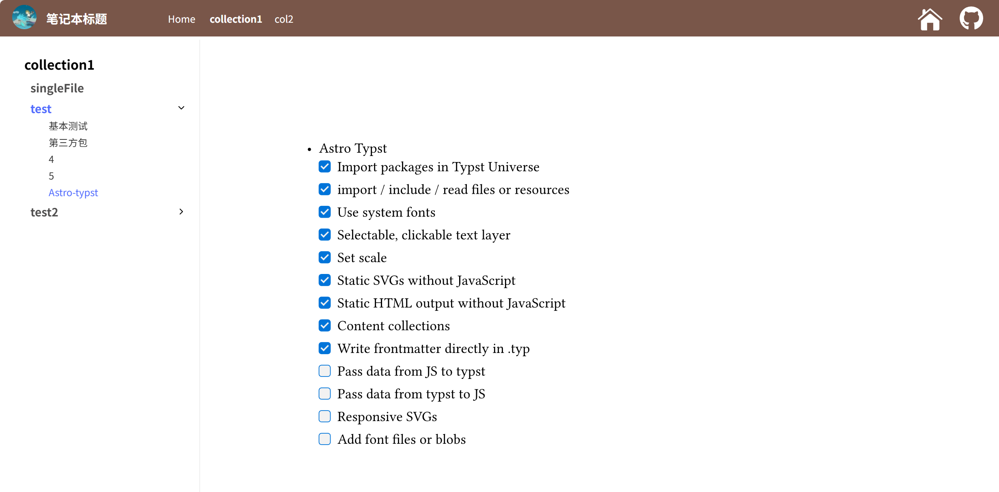

# Astro-typst Notebook

一个基于 [astro-typst](https://github.com/OverflowCat/astro-typst/tree/master) 的网页笔记本，支持 md 和 typ 两种格式

- Typst 原有的一些功能得到 astro-typst 的支持
  - [x] Import packages in Typst Universe
  - [x] import / include / read files or resources
  - [x] Use system fonts
  - [x] Selectable, clickable text layer
  - [x] Set scale
  - [x] Static SVGs without JavaScript
  - [x] Static HTML output without JavaScript
  - [x] Content collections
  - [x] Write frontmatter directly in .typ
  - [ ] Pass data from JS to typst
  - [ ] Pass data from typst to JS
  - [ ] Responsive SVGs
  - [ ] Add font files or blobs

实现方式比较丑陋且笨拙，不会前端且不熟悉 Astro，孩子不懂事做着玩的（x

- 例子


- 使用方法为在 `src/cotent` 下添加文件，然后定义 collection 即可，例如
```
src/cotent
    ├── config.ts
    ├── collection1
    │   ├── test.typ
    │   ├── index.typ
    │   ├── test
    │   │   ├── 基本测试.typ
    │   │   └── 第三方包.typ
    │   └── test2
    │       ├── 1.md
    │       └──2.typ
    └── col2
        ├── index.md
        ├── topic1
        │   └── 1.md
        └── topic2
            └── 1.typ

```
